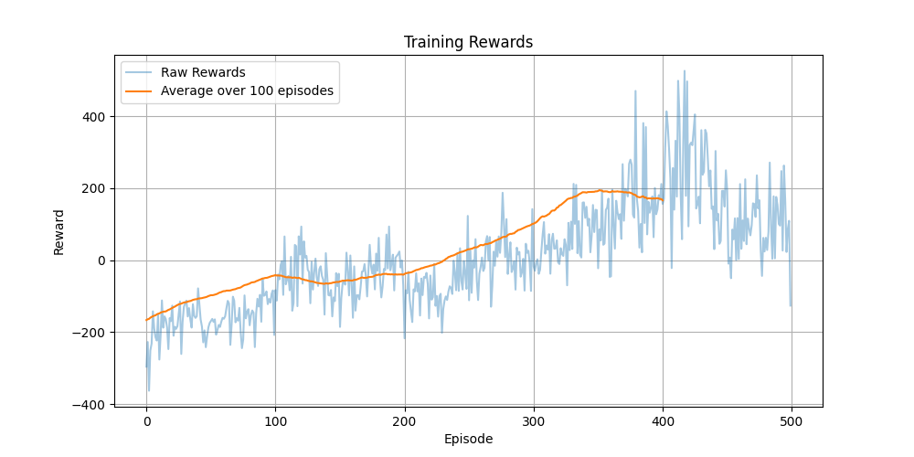
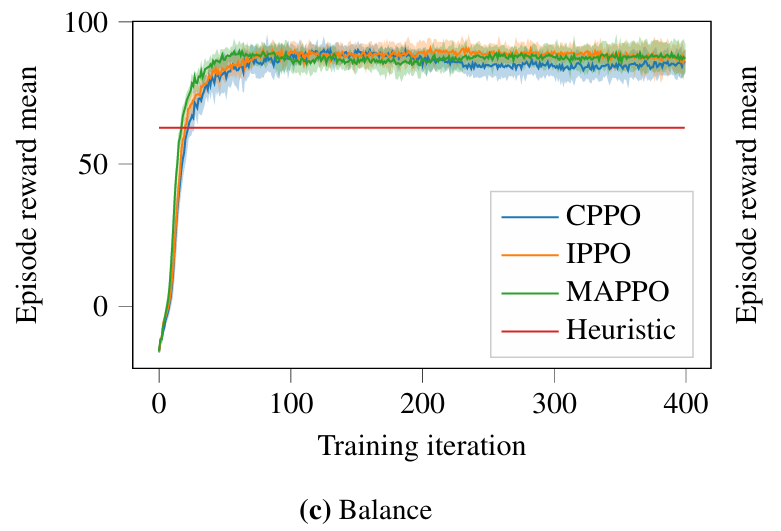
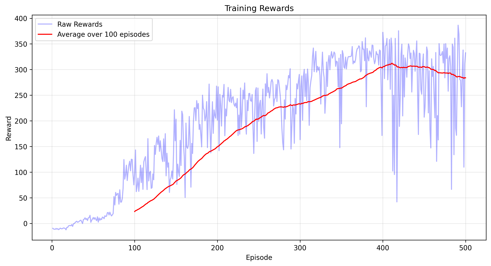
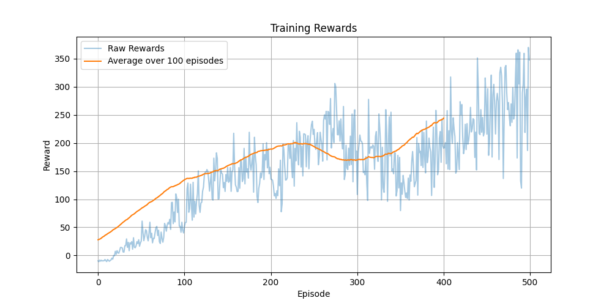
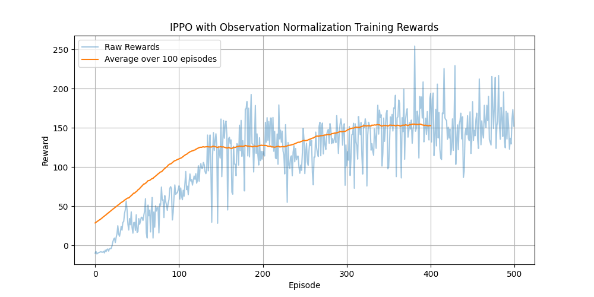

## 一、阅读论文《VMAS: A Vectorized Multi-Agent Simulator for Collective Robot Learning》并阅读源代码编写关键步骤代码注释。

### 1、核心架构设计

```python
# 核心组件说明
class World:  # vmas/simulator/core.py
    """
    世界类 - 整个模拟器的核心
    功能:
    1. 管理所有实体(agents和landmarks)
    2. 处理物理引擎更新 
    3. 处理碰撞检测
    4. 支持向量化并行环境
    5. 支持自定义重力、摩擦力等物理参数
    """

class Environment:  # vmas/simulator/environment/environment.py
    """
    环境类 - 多智能体环境管理
    功能:
    1. 场景管理和重置
    2. 动作空间和观察空间定义
    3. 奖励计算
    4. 状态更新
    5. 渲染显示
    """

class Agent:  # vmas/simulator/core.py
    """
    智能体类
    功能:
    1. 状态管理(位置、速度、加速度)
    2. 动作执行
    3. 碰撞处理
    4. 传感器接入
    """
```

### 2、物理引擎实现

```python
# 物理系统实现
class Shape:  # vmas/simulator/core.py
    """
    形状基类
    支持:
    1. 球体(Sphere)
    2. 方块(Box) 
    3. 线段(Line)
    """

class Dynamics:  # vmas/simulator/dynamics/common.py
    """
    动力学模型
    实现:
    1. 全向运动
    2. 差分驱动
    3. 自行车模型
    4. 无人机模型
    """

# 碰撞检测
def _get_closest_points():  # vmas/simulator/physics.py
    """
    碰撞检测算法
    支持:
    1. 球-球碰撞
    2. 球-方块碰撞  
    3. 球-线段碰撞
    4. 线段-线段碰撞
    """
```

### 3、场景系统

```python
class BaseScenario:  # vmas/simulator/scenario.py
    """
    场景基类
    关键方法:
    1. make_world() - 创建和初始化世界
    2. reset_world_at() - 重置特定环境状态
    3. observation() - 定义观察空间
    4. reward() - 定义奖励函数
    5. done() - 定义终止条件
    """

# 预置场景示例
class Football(BaseScenario):  # vmas/scenarios/football.py
    """
    足球场景
    特点:
    1. 多智能体协作
    2. 球的物理模拟
    3. 比赛规则实现
    """

class Navigation(BaseScenario):  # vmas/scenarios/navigation.py  
    """
    导航场景
    特点:
    1. 路径规划
    2. 避障
    3. 目标追踪
    """
```

### 4、传感器系统

```python
class Sensor:  # vmas/simulator/sensors.py
    """
    传感器基类
    支持:
    1. LIDAR激光雷达
    2. 通信信道
    3. 相机
    4. GPS
    """

class Controller:  # vmas/simulator/controllers/
    """
    控制器
    实现:
    1. PID控制
    2. 速度控制
    3. 位置控制
    """
```

### 5、向量化实现

```python
class TorchVectorizedObject:  # vmas/simulator/core.py
    """
    向量化基类
    功能:
    1. 批量并行环境
    2. GPU加速支持
    3. 自动微分
    4. 张量运算
    """

def vectorized_physics():  # vmas/simulator/physics.py
    """
    向量化物理计算
    实现:
    1. 批量碰撞检测
    2. 并行状态更新
    3. GPU加速
    """
```

### 6、渲染系统

```python
class Viewer:  # vmas/simulator/rendering.py
    """
    渲染器
    功能:
    1. 2D场景绘制
    2. 智能体可视化
    3. 调试信息显示
    4. 交互控制
    """

def render():  # vmas/simulator/environment/environment.py
    """
    渲染流程
    1. 场景绘制
    2. 智能体状态更新
    3. 碰撞显示
    4. UI元素
    """
```

### 7、训练接口

```python
# 标准强化学习接口
"""
兼容:
1. OpenAI Gym
2. Gymnasium
3. RLlib
4. TorchRL

标准化:
1. 动作空间
2. 观察空间  
3. 奖励函数
4. 重置函数
"""
```

## 二、选取论文中提到任务场景Balance，实现论文中提到的CPPO、MAPPO、IPPO 三种MARL算法，尝试复现论文中的结果。

### 1、CPPO(VectorizedMultiAgentSimulator/train_balance_cppo.py)

#### ①首先定义中央化Actor网络

```python
class CentralizedActor(nn.Module):
    def __init__(self, obs_dim, action_dim, n_agents, hidden_dim=512):
        super(CentralizedActor, self).__init__()
        self.n_agents = n_agents
        # 计算总的观察和动作维度
        total_obs_dim = obs_dim * n_agents  # 所有智能体观察空间的总维度
        total_action_dim = action_dim * n_agents  # 所有智能体动作空间的总维度
        
        # 构建特征提取网络
        self.net = nn.Sequential(
            nn.Linear(total_obs_dim, hidden_dim),
            nn.LayerNorm(hidden_dim),
            nn.Tanh(),
            nn.Linear(hidden_dim, hidden_dim),
            nn.LayerNorm(hidden_dim),
            nn.Tanh(),
            nn.Linear(hidden_dim, hidden_dim // 2),
            nn.LayerNorm(hidden_dim // 2),
            nn.Tanh(),
        )
        
        # 动作分布参数层
        self.mean_layer = nn.Linear(hidden_dim // 2, total_action_dim)  # 输出动作均值
        self.log_std = nn.Parameter(torch.zeros(1, total_action_dim) - 0.5)  # 可学习的标准差
        
        # 使用正交初始化
        for layer in self.net:
            if isinstance(layer, nn.Linear):
                nn.init.orthogonal_(layer.weight, gain=np.sqrt(2))
                nn.init.constant_(layer.bias, 0)
        nn.init.orthogonal_(self.mean_layer.weight, gain=0.01)
        nn.init.constant_(self.mean_layer.bias, 0)
```

#### ②定义中央化Critic网络

```python
class CentralizedCritic(nn.Module):
    def __init__(self, obs_dim, n_agents, hidden_dim=512):
        super(CentralizedCritic, self).__init__()
        total_obs_dim = obs_dim * n_agents  # 所有智能体观察空间的总维度
        
        # 构建价值评估网络
        self.net = nn.Sequential(
            nn.Linear(total_obs_dim, hidden_dim),
            nn.LayerNorm(hidden_dim),
            nn.Tanh(),
            nn.Linear(hidden_dim, hidden_dim),
            nn.LayerNorm(hidden_dim),
            nn.Tanh(),
            nn.Linear(hidden_dim, hidden_dim // 2),
            nn.LayerNorm(hidden_dim // 2),
            nn.Tanh(),
            nn.Linear(hidden_dim // 2, 1)  # 输出状态价值
        )
        
        # 使用正交初始化
        for layer in self.net:
            if isinstance(layer, nn.Linear):
                nn.init.orthogonal_(layer.weight, gain=np.sqrt(2))
                nn.init.constant_(layer.bias, 0)
```

#### ③实现CPPO训练器

```python
class CPPOTrainer:
    def __init__(self, env, device="cpu"):
        self.env = env
        self.device = device
        self.n_agents = len(env.agents)
        
        # 获取环境信息
        obs = env.reset()
        self.obs_dim = obs[0].shape[1]  # 单个智能体的观察维度
        self.action_dim = env.agents[0].action_size  # 单个智能体的动作维度
        
        # 创建Actor和Critic网络
        self.actor = CentralizedActor(self.obs_dim, self.action_dim, self.n_agents).to(device)
        self.critic = CentralizedCritic(self.obs_dim, self.n_agents).to(device)
        
        # 创建优化器
        self.actor_optimizer = optim.Adam(self.actor.parameters(), lr=3e-4)
        self.critic_optimizer = optim.Adam(self.critic.parameters(), lr=1e-3)
        
        # PPO超参数
        self.clip_param = 0.2  # PPO裁剪参数
        self.ppo_epochs = 15  # 每批数据的训练轮数
        self.num_mini_batches = 4  # mini-batch数量
        self.value_loss_coef = 0.5  # 价值损失系数
        self.entropy_coef = 0.05  # 熵正则化系数
        self.max_grad_norm = 0.5  # 梯度裁剪阈值
        self.gamma = 0.99  # 折扣因子
        self.gae_lambda = 0.95  # GAE参数
        
        # 经验缓冲区
        self.observations = []  # 存储观察
        self.actions = []  # 存储动作
        self.rewards = []  # 存储奖励
        self.values = []  # 存储价值估计
        self.log_probs = []  # 存储动作对数概率
        self.dones = []  # 存储终止标志
```

#### ④实现动作选择和采样

```python
def select_actions(self, obs_list):
    with torch.no_grad():
        # 获取动作分布参数
        mean, std = self.actor(obs_list)
        # 采样动作
        dist = Normal(mean, std)
        actions = dist.sample()
        actions = torch.clamp(actions, -1.0, 1.0)  # 限制动作范围
        log_probs = dist.log_prob(actions)
        entropy = dist.entropy().mean()
        
        # 分割动作给各个智能体
        action_dim = mean.shape[1] // self.n_agents
        actions_list = torch.split(actions, action_dim, dim=1)
        log_probs_list = torch.split(log_probs, action_dim, dim=1)
        
        # 获取状态价值估计
        value = self.critic(obs_list)
        
        return actions_list, log_probs_list, value, entropy
```

#### ⑤实现GAE计算

```python
def compute_gae(self):
    T = len(self.rewards)
    num_envs = self.rewards[0].shape[0]
    advantages = torch.zeros(T, num_envs, 1, device=self.device)
    returns = torch.zeros(T, num_envs, 1, device=self.device)
    last_gae_lam = torch.zeros(num_envs, 1, device=self.device)
    
    # 反向计算GAE
    for t in reversed(range(T)):
        if t == T - 1:
            next_value = torch.zeros_like(self.values[0])
        else:
            next_value = self.values[t + 1]
        
        # 计算TD误差
        delta = self.rewards[t] + self.gamma * next_value * (1 - self.dones[t]) - self.values[t]
        # 计算GAE
        advantages[t] = last_gae_lam = delta + self.gamma * self.gae_lambda * (1 - self.dones[t]) * last_gae_lam
        # 计算回报
        returns[t] = advantages[t] + self.values[t]
    
    # 标准化优势
    advantages = (advantages - advantages.mean()) / (advantages.std() + 1e-8)
    
    return advantages, returns
```

#### ⑥实现策略更新

```python
def update(self):
    # 计算GAE和回报
    advantages, returns = self.compute_gae()
    
    # 准备训练数据
    obs_batch = [torch.cat([obs[i] for obs in self.observations]) for i in range(self.n_agents)]
    actions_batch = [torch.cat([actions[i] for actions in self.actions]) for i in range(self.n_agents)]
    old_log_probs_batch = [torch.cat([log_probs[i] for log_probs in self.log_probs]) for i in range(self.n_agents)]
    
    batch_size = len(self.observations) * self.rewards[0].shape[0]
    mini_batch_size = batch_size // self.num_mini_batches
    
    # 多轮策略迭代
    for i in range(self.ppo_epochs):
        # 生成随机索引
        indices = torch.randperm(batch_size)
        
        for start in range(0, batch_size, mini_batch_size):
            end = start + mini_batch_size
            mb_indices = indices[start:end]
            
            # 获取mini-batch数据
            mb_obs = [obs[mb_indices] for obs in obs_batch]
            mb_actions = [actions[mb_indices] for actions in actions_batch]
            mb_old_log_probs = [old_log_probs[mb_indices] for old_log_probs in old_log_probs_batch]
            mb_advantages = advantages[mb_indices]
            mb_returns = returns[mb_indices]
            
            # 计算新的动作分布
            mean, std = self.actor(mb_obs)
            dist = Normal(mean, std)
            new_log_probs = dist.log_prob(torch.cat(mb_actions, dim=1))
            entropy = dist.entropy().mean()
            
            # 计算策略比率和损失
            new_log_probs_list = torch.split(new_log_probs, self.action_dim, dim=1)
            ratios = [(torch.exp(new_log_probs - old_log_probs)) for new_log_probs, old_log_probs in zip(new_log_probs_list, mb_old_log_probs)]
            surr1 = [ratio * mb_advantages for ratio in ratios]
            surr2 = [torch.clamp(ratio, 1.0 - self.clip_param, 1.0 + self.clip_param) * mb_advantages for ratio in ratios]
            actor_loss = -torch.mean(torch.stack([torch.min(s1, s2).mean() for s1, s2 in zip(surr1, surr2)]))
            
            # 计算价值损失
            value_pred = self.critic(mb_obs)
            value_loss = 0.5 * ((mb_returns - value_pred) ** 2).mean()
            
            # 计算总损失
            loss = actor_loss + self.value_loss_coef * value_loss - self.entropy_coef * entropy
            
            # 更新网络
            self.actor_optimizer.zero_grad()
            actor_loss.backward()
            torch.nn.utils.clip_grad_norm_(self.actor.parameters(), self.max_grad_norm)
            self.actor_optimizer.step()
            
            self.critic_optimizer.zero_grad()
            value_loss.backward()
            torch.nn.utils.clip_grad_norm_(self.critic.parameters(), self.max_grad_norm)
            self.critic_optimizer.step()
```

#### ⑦实现训练循环

```python
def train_episode(self):
    obs = self.env.reset()
    episode_reward = 0
    done = False
    
    while not done:
        # 选择动作
        actions_list, log_probs_list, value, _ = self.select_actions(obs)
        
        # 存储转换数据
        self.store_transition(
            obs,
            actions_list,
            torch.zeros(self.env.num_envs, 1, device=self.device),
            value,
            log_probs_list,
            torch.zeros(self.env.num_envs, 1, device=self.device)
        )
        
        # 执行动作
        next_obs, rewards, dones, _ = self.env.step(actions_list)
        done = any(d.any() for d in dones)
        
        # 更新奖励和状态
        mean_reward = torch.stack([r.mean(dim=0) for r in rewards]).mean() * 100
        self.rewards[-1] = mean_reward.expand(self.env.num_envs, 1)
        self.dones[-1] = torch.full((self.env.num_envs, 1), float(done), device=self.device)
        episode_reward += mean_reward.item()
        
        obs = next_obs
    
    # 更新策略
    actor_loss, value_loss, entropy = self.update()
    
    return actor_loss, value_loss, entropy, episode_reward
```

以上则是CPPO算法的实现过程。主要特点如下：

1. **集中训练：**
- Actor和Critic网络都接收所有智能体的联合观察
- 使用单一网络处理所有智能体的信息

2. **独立执行：**
- 动作被分割后分发给各个智能体
- 每个智能体独立执行动作

3. **PPO特性：**
- 使用策略裁剪限制更新步长
- 使用GAE计算优势函数
- 应用多轮策略迭代
- 使用熵正则化促进探索

4. **其他方面：**
- 使用LayerNorm提高训练稳定性
- 采用正交初始化避免梯度问题
- 应用梯度裁剪防止过大更新
- 标准化优势函数


**奖励曲线如下：**



**以下是论文中的结果：**



具体训练日志见根目录的文件`cppo_training_log.txt`。项目中以及保存好了训练好的模型`cppo_best_model.pth`和`cppo_final_model.pth`，同样位于项目根目录。

对比分析两张图的差异：

- 论文结果(`training_rewards.png`)：
  - 收敛速度快，在约50个迭代后就达到稳定
  - 收敛后波动较小，保持在90左右的稳定水平
  
- 复现结果(`cppo_training_rewards.png`)：
  - 收敛速度相对较慢，需要约300个episode才趋于稳定
  - 收敛后波动较大
  - 平均奖励(橙线)最终稳定在约200左右

### 2、MAPPO(VectorizedMultiAgentSimulator/train_balance_mappo.py)

#### ①Actor网络实现

```python
class Actor(nn.Module):
    def __init__(self, obs_dim, action_dim, hidden_dim=256):
        super(Actor, self).__init__()
        # 特征提取网络
        self.net = nn.Sequential(
            nn.Linear(obs_dim, hidden_dim),
            nn.LayerNorm(hidden_dim),
            nn.Tanh(),
            nn.Linear(hidden_dim, hidden_dim),
            nn.LayerNorm(hidden_dim),
            nn.Tanh(),
            nn.Linear(hidden_dim, hidden_dim // 2),
            nn.LayerNorm(hidden_dim // 2),
            nn.Tanh(),
        )
        # 动作分布参数层
        self.mean_layer = nn.Linear(hidden_dim // 2, action_dim)
        self.action_log_std = nn.Parameter(torch.zeros(1, action_dim) - 1.0)
```

#### ②Critic网络实现

```python
class Critic(nn.Module):
    def __init__(self, obs_dim, hidden_dim=256):
        super(Critic, self).__init__()
        # 价值评估网络
        self.net = nn.Sequential(
            nn.Linear(obs_dim, hidden_dim),
            nn.LayerNorm(hidden_dim),
            nn.Tanh(),
            nn.Linear(hidden_dim, hidden_dim),
            nn.LayerNorm(hidden_dim),
            nn.Tanh(),
            nn.Linear(hidden_dim, hidden_dim // 2),
            nn.LayerNorm(hidden_dim // 2),
            nn.Tanh(),
            nn.Linear(hidden_dim // 2, 1)
        )
```

#### ③MAPPO智能体实现

```python
class MAPPOAgent:
    def __init__(self, obs_dim, action_dim, device="cpu"):
        # 创建网络和优化器
        self.actor = Actor(obs_dim, action_dim).to(device)
        self.critic = Critic(obs_dim).to(device)
        self.actor_optimizer = optim.Adam(self.actor.parameters(), lr=3e-4)
        self.critic_optimizer = optim.Adam(self.critic.parameters(), lr=1e-3)
        
        # PPO超参数
        self.clip_param = 0.2
        self.max_grad_norm = 0.5
        self.ppo_epoch = 4
        self.batch_size = 64
        self.gamma = 0.99
        self.gae_lambda = 0.95
```

#### ④动作选择实现

```python
def get_action(self, obs):
    with torch.no_grad():
        # 获取动作分布参数
        mean, std = self.actor(obs)
        # 创建正态分布
        dist = Normal(mean, std)
        # 采样动作
        action = dist.sample()
        action = torch.clamp(action, -1.0, 1.0)
        # 计算动作的对数概率
        log_prob = dist.log_prob(action).sum(dim=-1, keepdim=True)
    return action, log_prob
```

#### ⑤优势函数计算

```python
def compute_advantages(self, rewards, values, agent_idx):
    # 计算GAE
    advantages = torch.zeros_like(rewards)
    returns = torch.zeros_like(rewards)
    last_gae_lam = torch.zeros(N, device=rewards.device)
    
    for t in reversed(range(T)):
        if t == T - 1:
            next_value = torch.zeros(N, device=rewards.device)
        else:
            next_value = values[t + 1]
        
        # 计算TD误差
        delta = rewards[t] + self.gamma * next_value - values[t]
        # 计算GAE
        last_gae_lam = delta + self.gamma * self.gae_lambda * last_gae_lam
        advantages[t] = last_gae_lam
        returns[t] = advantages[t] + values[t]
```

#### ⑥策略更新实现

```python
def update(self, observations, actions, old_log_probs, returns, advantages):
    for i in range(self.ppo_epoch):
        # 评估动作
        log_probs, entropy = self.evaluate_actions(observations, actions)
        ratio = torch.exp(log_probs - old_log_probs.detach())
        
        # 计算PPO目标
        surr1 = ratio * advantages.detach()
        surr2 = torch.clamp(ratio, 1.0 - self.clip_param, 1.0 + self.clip_param) * advantages.detach()
        actor_loss = -torch.min(surr1, surr2).mean()
        
        # 计算价值损失
        value_pred = self.critic(observations.detach())
        value_loss = 0.5 * ((returns.detach() - value_pred) ** 2).mean()
        
        # 更新网络
        self.actor_optimizer.zero_grad()
        actor_loss.backward()
        self.actor_optimizer.step()
        
        self.critic_optimizer.zero_grad()
        value_loss.backward()
        self.critic_optimizer.step()
```

#### ⑦训练循环实现

```python
def train_step(self):
    # 收集轨迹
    trajectories, episode_reward = self.collect_trajectories(max_steps)
    
    # 更新每个智能体
    for i in range(self.n_agents):
        traj = trajectories[i]
        # 计算优势
        advantages, returns = self.compute_advantages(
            traj['rewards'],
            traj['values'],
            i
        )
        # 更新策略
        actor_loss, value_loss, entropy = self.agents[i].update(
            traj['observations'],
            traj['actions'],
            traj['log_probs'],
            returns,
            advantages
        )
```

以上则是MAPPO算法的实现过程。主要特点如下：

1. 智能体独立：
- 每个智能体有自己的Actor和Critic网络
- 智能体独立进行决策和学习

2. 经验收集：
- 并行环境收集数据
- 存储观察、动作、奖励等轨迹信息

3. 策略优化：
- 使用PPO算法进行策略更新
- 应用重要性采样和策略裁剪
- 使用GAE计算优势函数

4. 训练稳定性：
- 使用LayerNorm和正交初始化
- 应用梯度裁剪
- 优势函数标准化


**奖励曲线如下：**



**以下是论文中的结果：**


具体训练日志见根目录的文件`mappo_training_log.txt`。项目中以及保存好了训练好的模型`mappo_best_model.pth`和`mappo_final_model.pth`，同样位于项目根目录。

对比分析两张图的差异：

- 论文结果(`training_rewards.png`)：
  - 收敛速度快，约50个迭代后就达到稳定
  - 收敛后波动小，稳定在90左右
  
- 复现结果(`mappo_training_rewards.png`)：
  - 收敛速度较慢，需要约300个episode才开始趋于稳定
  - 收敛后波动较大，Raw Rewards在100-350之间波动
  - 平均奖励(红线)最终稳定在约300左右

### 3、IPPO(VectorizedMultiAgentSimulator/train_balance_ippo.py)

#### ①Actor网络实现

```python
class Actor(nn.Module):
    def __init__(self, obs_dim, action_dim, hidden_dim=256):
        super(Actor, self).__init__()
        # 特征提取网络
        self.net = nn.Sequential(
            nn.Linear(obs_dim, hidden_dim),
            nn.LayerNorm(hidden_dim),
            nn.Tanh(),
            nn.Linear(hidden_dim, hidden_dim),
            nn.LayerNorm(hidden_dim),
            nn.Tanh(),
            nn.Linear(hidden_dim, hidden_dim // 2),
            nn.LayerNorm(hidden_dim // 2),
            nn.Tanh(),
        )
        # 动作分布参数层
        self.mean_layer = nn.Linear(hidden_dim // 2, action_dim)
        self.log_std = nn.Parameter(torch.zeros(1, action_dim) - 1.0)
```

#### ②Critic网络实现

```python
class Critic(nn.Module):
    def __init__(self, obs_dim, hidden_dim=256):
        super(Critic, self).__init__()
        # 价值评估网络
        self.net = nn.Sequential(
            nn.Linear(obs_dim, hidden_dim),
            nn.LayerNorm(hidden_dim),
            nn.Tanh(),
            nn.Linear(hidden_dim, hidden_dim),
            nn.LayerNorm(hidden_dim),
            nn.Tanh(),
            nn.Linear(hidden_dim, hidden_dim // 2),
            nn.LayerNorm(hidden_dim // 2),
            nn.Tanh(),
            nn.Linear(hidden_dim // 2, 1)
        )
```

#### ③独立PPO智能体实现

```python
class IPPOAgent:
    def __init__(self, obs_dim, action_dim, agent_id, device="cpu"):
        self.device = device
        self.agent_id = agent_id
        
        # 创建独立的Actor和Critic网络
        self.actor = Actor(obs_dim, action_dim).to(device)
        self.critic = Critic(obs_dim).to(device)
        
        # 创建优化器
        self.actor_optimizer = optim.Adam(self.actor.parameters(), lr=3e-4)
        self.critic_optimizer = optim.Adam(self.critic.parameters(), lr=1e-3)
        
        # PPO超参数
        self.clip_param = 0.2
        self.ppo_epochs = 10
        self.num_mini_batches = 4
        self.value_loss_coef = 0.5
        self.entropy_coef = 0.01
        self.max_grad_norm = 0.5
        self.gamma = 0.99
        self.gae_lambda = 0.95
```

#### ④动作选择实现

```python
def select_action(self, obs):
    with torch.no_grad():
        # 获取动作分布参数
        mean, std = self.actor(obs)
        # 创建正态分布
        dist = Normal(mean, std)
        # 采样动作
        action = dist.sample()
        action = torch.clamp(action, -1.0, 1.0)
        # 计算动作的对数概率和价值
        log_prob = dist.log_prob(action).sum(-1, keepdim=True)
        value = self.critic(obs)
    return action, log_prob, value
```

#### ⑤GAE计算实现

```python
def compute_gae(self):
    T = len(self.rewards)
    num_envs = self.rewards[0].shape[0]
    advantages = torch.zeros(T, num_envs, 1, device=self.device)
    returns = torch.zeros(T, num_envs, 1, device=self.device)
    last_gae_lam = torch.zeros(num_envs, 1, device=self.device)
    
    # 反向计算GAE
    for t in reversed(range(T)):
        if t == T - 1:
            next_value = torch.zeros_like(self.values[0])
        else:
            next_value = self.values[t + 1]
        
        # 计算TD误差
        delta = self.rewards[t] + self.gamma * next_value * (1 - self.dones[t]) - self.values[t]
        # 计算GAE
        advantages[t] = last_gae_lam = delta + self.gamma * self.gae_lambda * (1 - self.dones[t]) * last_gae_lam
        # 计算回报
        returns[t] = advantages[t] + self.values[t]
```

#### ⑥策略更新实现

```python
def update(self):
    # 计算GAE
    advantages, returns = self.compute_gae()
    
    # 准备数据
    observations = torch.cat(self.observations)
    actions = torch.cat(self.actions)
    old_log_probs = torch.cat(self.log_probs)
    
    # 多次策略迭代
    for i in range(self.ppo_epochs):
        # 计算新的动作分布
        mean, std = self.actor(mb_obs)
        dist = Normal(mean, std)
        new_log_probs = dist.log_prob(mb_actions).sum(-1, keepdim=True)
        entropy = dist.entropy().mean()
        
        # 计算PPO目标
        ratio = torch.exp(new_log_probs - mb_old_log_probs)
        surr1 = ratio * mb_advantages
        surr2 = torch.clamp(ratio, 1.0 - self.clip_param, 1.0 + self.clip_param) * mb_advantages
        actor_loss = -torch.min(surr1, surr2).mean()
        
        # 计算价值损失
        value_pred = self.critic(mb_obs)
        value_loss = 0.5 * ((mb_returns - value_pred) ** 2).mean()
        
        # 更新网络
        self.actor_optimizer.zero_grad()
        actor_loss.backward()
        self.actor_optimizer.step()
        
        self.critic_optimizer.zero_grad()
        value_loss.backward()
        self.critic_optimizer.step()
```

#### ⑦训练循环实现

```python
def train_episode(self):
    obs = self.env.reset()
    episode_reward = 0
    done = False
    
    while not done:
        # 每个智能体独立选择动作
        actions = []
        for i, agent in enumerate(self.agents):
            action, log_prob, value = agent.select_action(obs[i])
            actions.append(action)
            
            # 存储转换数据
            agent.store_transition(obs[i], action, rewards[i], value, log_prob, done)
        
        # 执行动作
        next_obs, rewards, dones, _ = self.env.step(actions)
        done = any(d.any() for d in dones)
        
        # 更新观察
        obs = next_obs
        episode_reward += sum(r.mean().item() for r in rewards)
    
    # 独立更新每个智能体
    for agent in self.agents:
        actor_loss, value_loss, entropy = agent.update()
```


以上则是IPPO算法的实现过程。主要特点如下：

1. 独立性：
- 每个智能体有独立的Actor和Critic网络
- 独立进行决策和学习
- 不共享任何参数或信息

2. 并行训练：
- 支持并行采样
- 每个智能体同时学习
- 使用mini-batch训练

3. PPO特性：
- 使用策略裁剪限制更新
- 应用GAE计算优势
- 使用熵正则化促进探索

4. 稳定性优化：
- 使用LayerNorm
- 应用正交初始化
- 使用梯度裁剪
- 标准化优势函数


**奖励曲线如下：**



**以下是论文中的结果：**


具体训练日志见根目录的文件`ippo_training_log.txt`。项目中以及保存好了训练好的模型`ippo_best_model.pth`和`ippo_final_model.pth`，同样位于项目根目录。

对比分析两张图的差异：

- 论文结果(`training_rewards.png`)：
  - 收敛速度快，约50个迭代后就达到稳定
  - 收敛后波动小，稳定在90左右
  
- 复现结果(`ippo_training_rewards.png`)：
  - 收敛速度较慢，需要约200个episode才开始趋于稳定
  - Raw Rewards波动较大，在100-350之间波动
  - 平均奖励(橙线)最终稳定在约200左右，且中间出现了一段性能下降(250-300 episode)

## 三、尝试改进上一步中的IPPO算法(train_balance_ippo_norm.py)。并阐明改进算法对于实际任务的必要性和优越性。

`train_balance_ippo_norm.py`相对于`train_balance_ippo.py`的主要改进如下：

1. **添加了观察值标准化器（ObservationNormalizer）**：
```python
class ObservationNormalizer:
    def __init__(self, shape, device):
        self.running_mean = torch.zeros(shape).to(device)
        self.running_var = torch.ones(shape).to(device)
        self.count = 1e-4
```
这是最主要的改进，它能够：
- 实时计算和更新观察值的均值和方差
- 对输入数据进行在线标准化处理
- 使用滑动平均来更新统计量，保持稳定性

2. **集成标准化处理到智能体类中**：
```python
def __init__(self, obs_dim, action_dim, agent_id, device="cpu"):
    # ...
    self.obs_normalizer = ObservationNormalizer(obs_dim, device)
```
- 在智能体初始化时创建标准化器实例
- 在动作选择和策略更新时使用标准化后的观察值

3. **改进的动作选择流程**：
```python
def select_action(self, obs):
    with torch.no_grad():
        normalized_obs = self.obs_normalizer.normalize(obs)
        mean, std = self.actor(normalized_obs)
        # ...
```
- 在选择动作前对观察值进行标准化
- 确保网络输入的数据分布更加稳定

改进的必要性和优越性体现在：

1. **训练稳定性**：
- 标准化处理使得不同维度的观察值都被缩放到相似的范围
- 避免了某些维度的值过大或过小导致的梯度问题
- 减少了训练过程中的数值不稳定性

2. **学习效率**：
- 标准化的数据分布更利于神经网络的学习
- 加快了网络收敛速度
- 减少了因数值范围不一致导致的训练困难

3. **泛化能力**：
- 标准化处理使得模型对不同尺度的输入都能很好地响应
- 提高了模型在不同环境状态下的适应能力


**改进前：**


**改进后：**



具体训练日志见根目录的文件`ippo_norm_training_log.txt`。项目中以及保存好了训练好的模型`ippo_norm_best_model.pth`和`ippo_norm_final_model.pth`，同样位于项目根目录。

可以看到改进后收敛速度加快了，也变得更稳定了。

## 四、研讨智能体数量对实验结果的影响，并在报告中对仿真结果进行讨论。

1. **系统复杂度**：
- 智能体数量直接影响系统的状态空间和动作空间维度
- 更多的智能体需要更复杂的交互关系
- 每个智能体都需要处理其他智能体的状态信息，计算复杂度随智能体数量增加而显著提升

2. **训练效率**：
- 智能体数量增加会导致训练时间延长
- 需要更多的计算资源来处理并行的环境
- 每个智能体的策略更新都需要考虑其他智能体的行为，降低了收敛速度

3. **观察空间的变化**：
```python
def observation(self, agent):
    # 观察空间随智能体数量变化
    # 每个智能体需要处理更多的相对状态信息
    observation = self.scenario.observation(agent)
```

4. **奖励分配**：
- 多智能体系统中的奖励分配会更加复杂
- 需要平衡个体奖励和团队奖励

